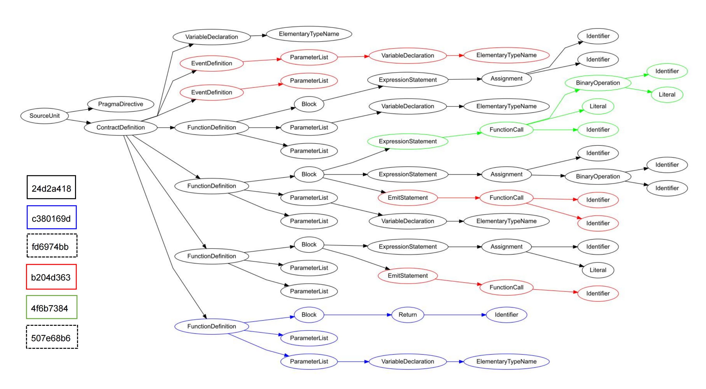
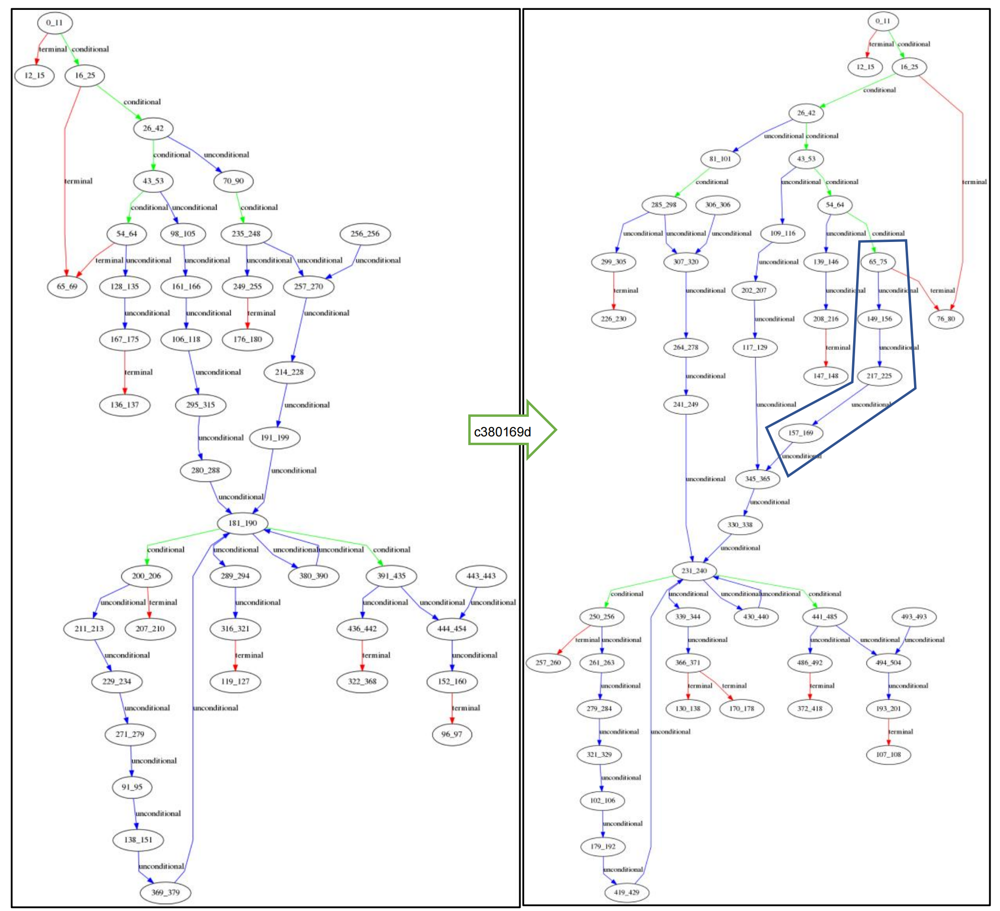
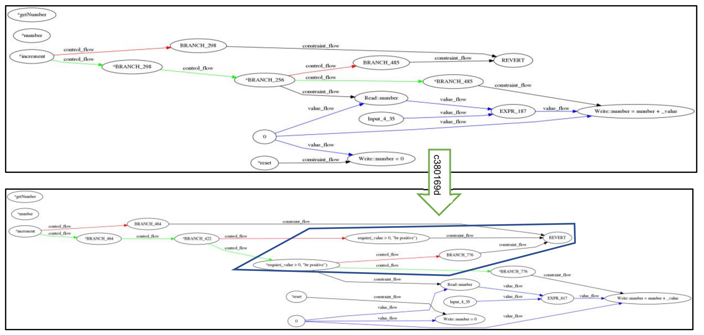

# Case Study: Dapp-Learning

## I. COMMITs

   The following table introduces 6 COMMITs (native NFT in Committable) from the dapp-learning project ([https://github.com/Dapp-Learning-DAO/Dapp-Learning.git)](https://github.com/Dapp-Learning-DAO/Dapp-Learning.git).
   
   | ID  | COMMIT                                  | Description                                            |
   | :--: | ---------------------------------------- | ------------------------------------------------------ |
   |  1   | 24d2a418580ca7e8dad292cc0d7dedf0f384e04a | create file increment.sol, implemente basic logic      |
   |  2   | c380169dd489e4bb1986f8690f995fb506086430 | modify increment.sol, add function getNumber           |
   |  3   | fd6974bb8eb86110a85d0cf17be3db6adec20b58 | rename directory of increment.sol                      |
   |  4   | b204d3636fa4afb6af0a4cffb6a0e0492b116555 | modify increment.sol，define two events，and emit them  |
   |  5   | 4f6b73844dea1b07a6ddb509a21eab9635fad032 | modify increment.sol，add require statment             |
   |  6   | 507e68b6bebdb19569928a1e453e4138f1a7df4f | modify increment.sol，add a comment                    |
   

&emsp;&emsp;&emsp;&emsp;&emsp;&emsp;&emsp;&emsp;&emsp;&emsp;&emsp;&emsp;&emsp;&emsp;&emsp;&emsp;&emsp;&emsp;&emsp;&emsp;&emsp;&emsp;&emsp;&emsp;Table1. description of COMMITs   
   
   The evolvement of this project is shown as below.

   | Example02-web3js-sendtransaction/Incrementer.sol | Example02-web3js-sendtransaction/Incrementer.sol | Example02-web3js-transaction/Incrementer.sol |
   | -------------------------------------------------------------------- | ------------------------------------------------------------ | ------------------------------------------------------------ |
   | pragma solidity ^0.8.0; contract Incrementer { &emsp;uint public number; &emsp;constructor(uint initial) { &emsp;&emsp;number = initial;  &emsp;} &emsp;function incre(int value) public { &emsp;&emsp;number = number + value; &emsp;&emsp;} &emsp;function reset() public { &emsp;&emsp;number = 0; &emsp;&emsp;} }|                pragma solidity ^0.8.0; contract Incrementer { &emsp;uint public number; &emsp;constructor(uint initial) { &emsp;&emsp;number = initial;  &emsp;} &emsp;function incre(int value) public { &emsp;&emsp;number = number + value; &emsp;} &emsp;function reset() public { &emsp;&emsp;number = 0; &emsp;} &emsp;function getNum() public {  &emsp;&emsp;return number; &emsp;} }   |                          pragma solidity ^0.8.0; contract Incrementer { &emsp;uint public number; &emsp;constructor(uint initial) { &emsp;&emsp;number = initial;  &emsp;} &emsp;function incre(uint value) public { &emsp;&emsp;number = number + value; &emsp;&emsp;} &emsp;function reset() public { &emsp;&emsp;number = 0; &emsp;&emsp;} &emsp;function getNum() public {  &emsp;&emsp;return number; &emsp;} }                                    |
   | Example02-web3js-transaction/Incrementer.sol | Example02-web3js-transaction/Incrementer.sol | Example02-web3js-transaction/Incrementer.sol |
   |                                 // SPDX-License-Identifier:  MIT  pragma solidity ^0.8.0; contract Incrementer { &emsp;uint public number; &emsp;event Increment(uint256 value); &emsp;event Reset(); &emsp;constructor(uint initial) { &emsp;&emsp;number = initial;  &emsp;} &emsp;function incre(uint value) public { &emsp;&emsp;require(value > 0,  "be positive"); &emsp;&emsp;number = number + value; &emsp;&emsp;emit Increment(_value); &emsp;&emsp;} &emsp;function reset() public { &emsp;&emsp;number = 0; &emsp;&emsp;emit Reset(); &emsp;&emsp;} &emsp;function getNum() public {  &emsp;&emsp;return number; &emsp;} }                            |            pragma solidity ^0.8.0; contract Incrementer { &emsp;uint public number; &emsp;event Increment(uint256 value); &emsp;event Reset(); &emsp;constructor(uint initial) { &emsp;&emsp;number = initial;  &emsp;} &emsp;function incre(uint value) public { &emsp;&emsp;require(value > 0,  "be positive"); &emsp;&emsp;number = number + value; &emsp;&emsp;emit Increment(_value); &emsp;&emsp;} &emsp;function reset() public { &emsp;&emsp;number = 0; &emsp;&emsp;emit Reset(); &emsp;&emsp;} &emsp;function getNum() public {  &emsp;&emsp;return number; &emsp;} }                                                  |                  pragma solidity ^0.8.0; contract Incrementer { &emsp;uint public number; &emsp;event Increment(uint256 value); &emsp;event Reset(); &emsp;constructor(uint initial) { &emsp;&emsp;number = initial;  &emsp;} &emsp;function incre(uint value) public { &emsp;&emsp;number = number + value; &emsp;&emsp;emit Increment(_value); &emsp;&emsp;} &emsp;function reset() public { &emsp;&emsp;number = 0; &emsp;&emsp;emit Reset(); &emsp;&emsp;} &emsp;function getNum() public {  &emsp;&emsp;return number; &emsp;} }                                            | 

&emsp;&emsp;&emsp;&emsp;&emsp;&emsp;&emsp;&emsp;&emsp;&emsp;&emsp;&emsp;&emsp;&emsp;&emsp;&emsp;&emsp;&emsp;&emsp;&emsp;&emsp;&emsp;&emsp;&emsp;Table2. code evolvement of COMMITs   

## II. Development
The following visually demonstrates development contributions related to the 6 COMMITs.

### Structure: Abstract Syntax Tree (AST)

### Structure: Control Flow Graph (CFG)

### Semantics: Dependency Graph (DG)

   
## III. Meta-Commit Digest
A meta-commit digest is an encoding of the raw meta-commit data.

<table>
    <tr>
        <td rowspan="3">&emsp;&emsp;COMMIT</td>
        <td colspan="6">&emsp;&emsp;&emsp;&emsp;&emsp;&emsp;&emsp;Structure</td>
        <td colspan="2">&emsp;&emsp;&emsp;Semantics</td>
    </tr>
    <tr>
        <td colspan="2">sequence</td>
        <td colspan="2">selection</td>
        <td colspan="2">&emsp;loop</td>
        <td rowspan="2">data flow</td>
        <td rowspan="2">control flow</td>
    </tr>
    <tr>
        <td>src</td>
        <td>exe</td>
        <td>src</td>
        <td>exe</td>
        <td>src</td>
        <td>exe</td>
    </tr>
    <tr>
        <td>COMMIT-24d2a418</td>
        <td>+3</td>
        <td>+39</td>
        <td>+0</td>
        <td>+7</td>
        <td>+0</td>
        <td>+2</td>
        <td>&emsp;&emsp;+7</td>
        <td>&emsp;&emsp;+5</td>
    </tr>
    <tr>
        <td>COMMIT-c380169d</td>
        <td>+1</td>
        <td>+5</td>
        <td>+0</td>
        <td>+1</td>
        <td>+0</td>
        <td>+0</td>
        <td>&emsp;&emsp;+1</td>
        <td>&emsp;&emsp;+0</td>
    </tr>
    <tr>
        <td>COMMIT-fd6974bb</td>
        <td>+0</td>
        <td>+0</td>
        <td>+0</td>
        <td>+0</td>
        <td>+0</td>
        <td>+0</td>
        <td>&emsp;&emsp;+0</td>
        <td>&emsp;&emsp;+0</td>
    </tr>
    <tr>
        <td>COMMIT-b204d363</td>
        <td>+2</td>
        <td>+2</td>
        <td>+0</td>
        <td>+0</td>
        <td>+0</td>
        <td>+1</td>
        <td>&emsp;&emsp;+0</td>
        <td>&emsp;&emsp;+0</td>
    </tr>
    <tr>
        <td>COMMIT-4f6b7384</td>
        <td>+1</td>
        <td>+9</td>
        <td>+1</td>
        <td>+1</td>
        <td>+0</td>
        <td>+0</td>
        <td>&emsp;&emsp;+0</td>
        <td>&emsp;&emsp;+2</td>
    </tr>
    <tr>
        <td>COMMIT-507e68b6</td>
        <td>+0</td>
        <td>+0</td>
        <td>+0</td>
        <td>+0</td>
        <td>+0</td>
        <td>+0</td>
        <td>&emsp;&emsp;+0</td>
        <td>&emsp;&emsp;+0</td>
    </tr>
</table>

&emsp;&emsp;&emsp;&emsp;&emsp;&emsp;&emsp;&emsp;&emsp;&emsp;&emsp;&emsp;&emsp;&emsp;&emsp;&emsp;&emsp;Table3. Meta-Commit digest   

## IV. PSR Contribution
| ID   | COMMIT                                   | P |  S&emsp;  |  R  | Contribution |
| ---- | ---------------------------------------- | ---- | ---: | ---: | -----------: |
| 1    | 24d2a418580ca7e8dad292cc0d7dedf0f384e04a | High | 0.28 |  1.0 |       138.65 |
| 2    | c380169dd489e4bb1986f8690f995fb506086430 | High | 0.18 |  1.0 |        88.13 |
| 3    | fd6974bb8eb86110a85d0cf17be3db6adec20b58 | Mid  | 0.10 |  1.0 |       49.351 |
| 4    | b204d3636fa4afb6af0a4cffb6a0e0492b116555 | Mid  | 0.17 |  1.0 |        84.71 |
| 5    | 4f6b73844dea1b07a6ddb509a21eab9635fad032 | Mid  | 0.19 |  1.0 |        94.74 |
| 6    | 507e68b6bebdb19569928a1e453e4138f1a7df4f | Low  | 0.11 |  1.0 |        54.41 |

&emsp;&emsp;&emsp;&emsp;&emsp;&emsp;&emsp;&emsp;&emsp;&emsp;&emsp;&emsp;&emsp;&emsp;&emsp;&emsp;Table4. PSR contribution of COMMITs   

| ID   | COMMIT                                   | PSR Contribution | Manual Evaluation |
| ---- | ---------------------------------------- | -----------: | :-----------: |
| 1    | 24d2a418580ca7e8dad292cc0d7dedf0f384e04a |       138.65 | 4 |
| 2    | c380169dd489e4bb1986f8690f995fb506086430 |        88.13 | 2 |
| 3    | fd6974bb8eb86110a85d0cf17be3db6adec20b58 |       49.351 | 1 |
| 4    | b204d3636fa4afb6af0a4cffb6a0e0492b116555 |        84.71 | 2 |
| 5    | 4f6b73844dea1b07a6ddb509a21eab9635fad032 |        94.74 | 3 |
| 6    | 507e68b6bebdb19569928a1e453e4138f1a7df4f |        54.41 | 1 |

&emsp;&emsp;&emsp;&emsp;&emsp;&emsp;&emsp;&emsp;&emsp;&emsp;&emsp;&emsp;&emsp;Table5. Contribution acceptance 

### Interpretation of the results
- PSR contribution is generally consistent with manual decisions with high correlation coefficients, i.e., 0.97 and 0.93 for the Spearman and Kendall standard respectively. 
- COMMIT-24d2a4 is given the highest PSR contribution because it is addressing a high-priority problem and delivers more workload than others as shown above. In the opposite, 507e68 and fd6974 are ranked lowest since they are only adding one comment and renaming a file in the project. 
- The comparisons between 4f6b73 and b204d3, also 4f6b73 and c38016, are interesting based on PSR since 4f6b73 outperforms the other two with less lines of code modified. The reason behind is that 4f6b73 contributes more to the software on structures and semantics, even with a single line of code.

